# Guion de Presentación (Elevator Pitch - 3 Minutos)
**Proyecto:** ¿Qué perfil de estudiante consigue una práctica profesional?  
**Integrantes:** Marcelo Rebolledo, Sebastián Bustos, Esteban Massa, Francisco Sanhueza.  
**Repositorio:** [github.com/franciscoSM/reglas-asociacion-seleccion-pasantias](https://github.com/franciscoSM/reglas-asociacion-seleccion-pasantias)

---

## ⏱️ Distribución del Tiempo (Total: 3 Minutos)

```mermaid
gantt
    title Estructura del Pitch (180 segundos)
    dateFormat  X
    axisFormat %s
    section Pitch
    Introducción y Problema (30s)     :active, 0, 30
    Datos y Metodología (45s)         : 30, 75
    Resultados y Reglas Clave (45s)    : 75, 120
    Casos de Uso / Demo (40s)          : 120, 160
    Conclusiones y Cierre (20s)        : 160, 180
```

---

## 🎤 Opción A: Presentador Único (Vocero Principal)
*Recomendada para maximizar la fluidez, evitar pérdidas de tiempo en transiciones y asegurar el cumplimiento del límite de 3 minutos.*

### 1. Introducción y Problema (0:00 - 0:30) | ~75 palabras
> **[Gancho inicial mirando a los evaluadores]**  
> Buenos días. Imaginen que están a punto de egresar y necesitan encontrar su práctica profesional. Tienen un promedio sobresaliente, pero ¿es eso suficiente?  
> Nuestro proyecto nace de esta pregunta: **¿Qué perfil de estudiante realmente consigue una práctica?**  
> Para responderlo, en lugar de crear un modelo predictivo de caja negra, decidimos buscar **patrones de asociación** claros y explicables para los estudiantes. Nuestro objetivo es identificar qué combinaciones de factores académicos, técnicos y sociales se relacionan con el éxito.

### 2. Datos y Metodología (0:30 - 1:15) | ~110 palabras
> **[Señalar secciones 4, 5 y 6 del papelógrafo]**  
> Para esto, analizamos los datos de 1,000 estudiantes en el *Internship Selection Dataset*. Evaluamos tres dimensiones: la **Académica** (promedio CGPA y asignaturas reprobadas), la **Técnica** (puntaje de habilidades y proyectos), y la **Social** (GitHub, LinkedIn y hackathons).  
> Convertimos estos datos continuos en variables binarias y aplicamos el **Algoritmo Apriori**, el cual implementamos desde cero en Python.  
> Definimos umbrales estratégicos en nuestro poster: un **Soporte** mínimo del 4% para asegurar reglas representativas (al menos 40 estudiantes), una **Confianza** del 70% para garantizar probabilidad de éxito, y un **Lift** mayor a 1 para encontrar reglas con impacto real sobre el promedio base de selección, que es del 54.4%.

### 3. Resultados y Reglas Clave (1:15 - 2:00) | ~110 palabras
> **[Señalar secciones 7, 8 y el diagrama radial]**  
> A través de la poda de Apriori, pasamos de miles de combinaciones a **68 reglas válidas** que conducen a la obtención de la práctica.  
> En nuestro gráfico de Lift vs. Confianza y el esquema radial, observamos algo revelador: **las notas solas no bastan**.  
> Las combinaciones con mayor confianza y Lift combinan variables técnicas y sociales. Por ejemplo, la regla de **Habilidades Altas + Proyectos Completados** alcanza una confianza del 78.4% (Lift 1.06). Asimismo, la marca personal digital, reflejada en tener un **GitHub activo junto con un LinkedIn activo**, demostró ser un factor diferenciador clave para los reclutadores.

### 4. Casos de Uso / Demostración Práctica (2:00 - 2:40) | ~100 palabras
> **[Señalar sección 9: Ejemplos de uso]**  
> Para ver esto en la práctica, analicemos tres casos de nuestro modelo:  
> * Primero, **Camila**: tiene habilidades técnicas altas, proyectos y un GitHub activo. Su confianza para conseguir práctica es del **76.8%** (con un Lift de 1.41).  
> * En contraste, **Diego**: tiene un promedio académico excelente (CGPA Alta) pero no tiene proyectos. Su probabilidad cae drásticamente a solo **23.7%** (Lift de 0.43).  
> * Y finalmente **Valentina**, que no cuenta con proyectos, portafolio ni certificaciones, quedando en la zona de baja probabilidad.  
> Esto evidencia que la falta de aplicación práctica anula la ventaja de una buena calificación.

### 5. Conclusiones y Cierre (2:40 - 3:00) | ~55 palabras
> **[Señalar sección 10 y enlace de GitHub]**  
> En conclusión, el perfil óptimo es **integral**: complementa la estabilidad académica con proyectos prácticos y visibilidad digital.  
> Como límite, el dataset es de Kaggle, por lo que a futuro buscaremos aplicar esto con datos locales de la UFRO. Los invitamos a escanear nuestro repositorio de GitHub para revisar el código. Muchas gracias.

---

## 👥 Opción B: Presentación Compartida (4 Integrantes)
*Si la rúbrica exige que todos hablen, es vital coordinar las transiciones de forma rápida y sin pausas. Cada integrante debe pararse junto a la sección del poster que le corresponde explicar.*

### 👤 Integrante 1: Marcelo (Introducción y Problema | 0:00 - 0:45)
> "Buenos días. Imaginen que están a punto de egresar y necesitan encontrar su práctica profesional. Tienen un promedio sobresaliente, pero ¿es eso suficiente?  
> Nuestro proyecto nace de esa incertidumbre con la pregunta guía: **¿Qué perfil de estudiante realmente consigue una práctica?**  
> Nuestro objetivo no es predecir de forma automatizada, sino encontrar **patrones de asociación** comprensibles. Queremos mostrarle a los estudiantes qué combinaciones de sus habilidades académicas, técnicas y sociales influyen directamente en que un reclutador los seleccione."

### 👤 Integrante 2: Sebastián (Datos y Metodología | 0:45 - 1:30)
> "Para lograrlo, tomamos los datos de 1,000 estudiantes de la plataforma Kaggle. Estudiamos variables académicas como las notas, técnicas como los proyectos completados, y sociales como la actividad en GitHub o LinkedIn.  
> Transformamos estos datos en variables transaccionales y programamos desde cero en Python el **Algoritmo Apriori**.  
> Para filtrar las reglas más valiosas, definimos un soporte mínimo del 4% (que representa al menos 40 alumnos), una confianza mínima del 70% de éxito, y un Lift mayor a 1 para asegurar que las reglas superen el promedio base de selección del dataset, que es del 54.4%."

### 👤 Integrante 3: Esteban (Resultados y Esquema | 1:30 - 2:15)
> "Aplicando el algoritmo, obtuvimos **68 reglas válidas** que guían al éxito.  
> Si observan nuestro gráfico de Lift vs Confianza y el esquema radial, el resultado es contundente: **las notas por sí solas no garantizan una práctica**.  
> La regla con mayor confianza, del 78.4%, exige la combinación de **Habilidades Técnicas Altas y Proyectos Prácticos**. Asimismo, la marca personal reflejada en un **GitHub y LinkedIn activos** actúa como un puente directo al empleo, potenciando significativamente la visibilidad frente a las empresas."

### 👤 Integrante 4: Francisco (Demo, Conclusiones y Cierre | 2:15 - 3:00)
> "Veámoslo con tres ejemplos reales de nuestro modelo:  
> **Camila** tiene proyectos y GitHub activo; su probabilidad de éxito es del **76.8%**. **Diego**, a pesar de tener excelentes notas, no tiene proyectos, y su probabilidad se desploma al **23.7%**. **Valentina**, sin portafolio ni proyectos, tiene la probabilidad más baja.  
> Esto demuestra que el perfil exitoso es **integral**. Aunque nuestro modelo actual usa datos sintéticos de Kaggle y planeamos extenderlo al contexto de la UFRO, la lección es clara: hay que programar y mostrar el trabajo. Los invitamos a revisar nuestro código en el enlace a GitHub del póster. Muchas gracias."

---

## 💡 Consejos para el Éxito (Basados en la Rúbrica)

1. **Evidencia del Trabajo (Demostración)**: El evaluador buscará "evidencia clara del trabajo desarrollado". Tengan un celular o tablet a mano con el Notebook abierto (`reglas_asociacion_proyecto.ipynb`) o el repositorio de GitHub listo. Si les hacen preguntas, muestren el código implementado desde cero para demostrar rigurosidad técnica.
2. **Apoyo Visual (No lean)**: El papelógrafo está estructurado con números (del 1 al 10). A medida que avancen en el guion, apunten físicamente con la mano al número correspondiente. Esto ayuda a los evaluadores a seguir el hilo de la presentación sin perderse.
3. **El Ritmo**: Practiquen con un cronómetro. Si presentan en grupo, ensayen el cambio de voz para que no tome más de 2 segundos entre compañeros. Si se pasan de 3 minutos, les bajarán la nota de síntesis.
4. **Vocabulario Técnico**: Utilicen con seguridad términos como *Soporte*, *Confianza*, *Lift*, *Itemsets frecuentes* y *Poda de Apriori*. La rúbrica evalúa la "comunicación oral" y la "aplicación de la técnica seleccionada".
